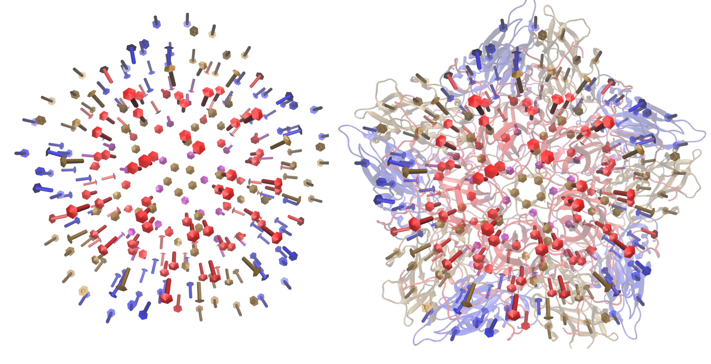

NMA Tutorial
====================================

Enterovirus 71 (EV-71) is a human pathogen that predominantly infects small children. The capsid is icoshedral and contains 60 protomer units. In a **mature capsid** the protomers are assembled as a set of 12 pentamers. Each protomer contains a single copy of the proteins VP1-VP4. During infection the virus capsid expands to release its RNA into the host cell. This expanded capsid is known as the **A-particle.**

Aim
-----------

In this tutorial we will apply the ANM model to a single pentamer of the mature EV-71 capsid. We aim to identify the normal modes that contribute to the conformational changes within a pentamer during capsid expansion.

Create a working directory
-------------------------------

First create a directory for all the MODE-TASK scripts using the Linux command:

 ::

	mkdir ModeTask

Copy the entire contents of the MODE-TASK Scripts in to the MODE-TASK directory.

Within this directory create a folder called **Tutorial:**

 ::

	cd ModeTask
	mkdir Tutorial

We will run all scripts from the ModeTask directory. 

Preparation of structure of the mature capsid
---------------------------------------------

1) Download the 3VBS biological assembly (3VBS.pdb1) of the **mature EV-71 capsid** from the PDB.

2) Open 3VBS.pdb1 in PyMol.

3) Use the **split_states 3VBS** command to visualise the full capsid.

4) Save the capsid: File – Save Molecule – Select the first 5 states. Save as EV71_Pentamer.pdb into the **ModeTask/Tutorial directory.**

Each protomer has 4 subunits: VP1-VP4. VP4 is an internal capsid protein.

* Number of residues per protomer = 842

* Number of residues per pentamer = 4210

The estimated run time to perfom ANM on a complex of 4210 residues, using **Mode Task** is 25 hours. 

For the sake of this tutorial we will use the **coarseGrain.py** script to construct a pentamer with lower resolution pentamer.

Preparation of structure of the A-partcile capsid
-------------------------------------------------

1) Download the 4N43 biological assembly (4N43.pdb1) of the **A-partcile EV-71 capsid** from the PDB.

2) Open 4N43.pdb1 in PyMol.

3) Use the **split_states 4N43** command to visualise the full capsid.

4) Save the capsid: File – Save Molecule – Select the first 5 states. Save as Apart_Pentamer.pdb into the **ModeTask/Tutorial directory.**

Coarse grain
-------------------------------

The MODE-TASK package is designed to analyse both single proteins or larger macromolecules such as a virus capsid. The ANM.cpp script contructs an elastic network model on all CA or CB atoms in a given PDB file. This is ideal for smaller protein complexes. For larger protein complexes the coarseGrained.py script can be used to construct an additional coarse grained PDB file. 

1) Create a two models of the EV71 Pentamer complex with additional coarse graining set at levels 3 and 4 of selected CB atoms:

 ::

	coarseGrain.py --pdb Tutorial/EV71_Pentamer.pdb --cg 3,4 --startingAtom 1 --output EV71_CG3.pdb --outdir Tutorial --atomType CB

**The input paramaters include:**

	* pdb: This is the pdb structure that you wish to coarse grain
	* cg: This specifies the levels of coarse graining. To select fewer atoms increase the level
	* starting atom: This specifies the first residue to be selected in the complex
	* output: The filename of the coarse grained pdb file
	* outdir: The directory in which to save the coarse grained pdb file

**Output:**

a) EV71_CG3.pdb and EV71_CG4.pdb : Two separate coarse grained pdb files that have the coordinates of selected CB atoms from residues that are equally distributed across the complex.
   As an example EV71_CG3.pdb is shown the figure below.
b) Command line output

 ::

	============================================================
	Started at: 2017-12-12 11:34:36.399300
	------------------------------------------------------------
	SUMMARY OF COARSE GRAINING PERFORMED AT LEVEL 3
	No. atoms selected per unit: 122 from 842 orignal residues
	No. atoms selected per macromolecule: 610 from 4210 orignal residues
	------------------------------------------------------------
	------------------------------------------------------------
	SUMMARY OF COARSE GRAINING PERFORMED AT LEVEL 4
	No. atoms selected per unit: 54 from 842 orignal residues
	No. atoms selected per macromolecule: 270 from 4210 orignal residues
	------------------------------------------------------------
	Completed at: 2017-12-12 11:34:36.541637
	- Total time: 0:00:00

Note that, the same set of 122 atoms from each protomer were selected for CG3, likewise, the same set of 54 aatoms from each protomer were selected for CG4 – thus the symmetry of the pentamer is retained.

 .. figure:: ../img/nma_tut0.png
   :align: center

   Fig: Left) Crystal structure of the EV71 Pentamer (3VBS). Right) EV71_CG3.pdb contains 610 CB atoms from 4210 total residues. 

Mode decomposition
-------------------------------

The ANM.cpp script accepts a PDB file and a cutoff distance. The script constructs the Hessian matrix connecting all CB atoms within the specific cutoff radius.  The script then performs singular value decompostion to return the eigenvalues and eigenvectors of the Hessian matrix. 

**Input parameters:**

* pdb: path to PDB file
* cutoff: cutoff radius in A. The script will construct an eleastic network model by connecting all atoms that interact within the cutoff distance (default = 15Å)
* outdir: folder in which output is saved

**Output:**

W_values.txt: A list of 3N eigenvalues the normal modes of the system. Eigenvalues are ordered from slowest to fastest.

VT_values.txt: A 3Nx3N list of the eigenvectors for each mode. Eigenvectors are printed as a set of rows.

U_values.txt: A 3Nx3N list of the eigenvectors for each mode. Eigenvectors are printed as a set of columns. 

1) Compile the ANM.cpp script

The ANM.cpp script requires classes of the AlgLib library. These classes can be found in the cpp/src folder in the GitHub Directory. The path to these classes must be specified in the compile command using the -I paramter:

 ::

	g++ -I cpp/src/ ANM.cpp -o ANM

In this tutorial we will perform a comprative analysis between the normal modes of the EV71_CG3.pdb and EV71_CG4.pdb 

2) Run the ./ANM to analyse EV71_CG4.pdb with a cutoff of 24Å

 ::

	./ANM --pdb Tutorial/EV71_CG4.pdb  --outdir Tutorial --atomType CB --cutoff 24

Example of the command line output:

 ::

	Started at: 2017-08-22 11:55:33
	Starting Decomposition
	Completed at: 2017-08-22 11:55:47
	- Total time: 0:00:13

3) Run the ./ANM to analyse  EV71_CG3.pdb

3.1) First make a sub-directory to avoid overwriting of your previous ANM outout:

 ::

	mkdir Tutorial/CG3

3.2)  ::

	./ANM --pdb Tutorial/EV71_CG3.pdb --outdir Tutorial/CG3 --atomType CB --cutoff 24

Example of command line output:

 ::

	Started at: 2017-08-22 11:56:42
	Starting Decomposition
	Completed at: 2017-08-22 11:59:14
	- Total time: 0:02:0-704

Indentification of modes that contribute to the conformational change
-------------------------------------------------------------------------

We have performed ANM on two separate pentamer complexes. From each model we have obtained a set of eigenvalues and eigenvectors corresponding to each normal mode:

1) EV71_CG4.pdb, total non-trivial modes = 804

2) EV71_CG3.pdb, total non-trivial modes = 1824

For each model we will now identify the modes that contribute to the conformational change of a pentamer during capsid expansion.

We will then compare the modes from the respective models and determine if the additional coarse graining affected the ability to capture such modes. 

To determine if our modes overlap with the direction of conformational change, we must first determine the conformational change between the crystal structures of the **mature** and **A-particle pentamer.** The **conformationMode.py**  scripts take two UNALIGNED pdb files and the set of all eigenvectors determined for the complex. The script aligns the structures, calculates the known conformational change and then identifies which modes contribute to the change.

Prepare the A-partcile pentamer in PyMol, using the biological assembly: 4n43.pdb1

Conformation mode
-------------------------------

1) Compute overlap between all modes of the EV71_CG4 model:

 ::

	conformationMode.py --pdbANM Tutorial/EV71_CG4.pdb --vtMatrix Tutorial/VT_values.txt  --pdbConf Tutorial/Apart_Pentamer.pdb --outdir Tutorial/ --atomType CB

**Input paramters:**
 
--pdbANM: This is the PDB file that you use to run ANM. Do not use the aligned file here

--vtMatrix: The eigenavalues obtained from ANM of the EV71_CG4 model

--pdbConf: This is the pdb file of the conformational change. In this case the pentamer of the A-particle (The –pdbANM and –pdbConf must NOT BE ALIGNED)

**Output:**

A text file with the overlap and correlation of each mode to the conformational change. The modes are ordered by the absolute value of their overlap.

2) Compute overlap between all modes of the EV71_CG3 model (Remember to specify the correct directory):

 ::

	conformationMode.py --pdbANM Tutorial/EV71_CG3.pdb --vtMatrix Tutorial/CG3/VT_values.txt  --pdbConf Tutorial/Apart_Pentamer.pdb --outdir Tutorial/CG3 --atomType CB

**Top output from conformationalMode.py of EV71_CG4:**

 ::

	MODE           Overlap             Correlation

	Mode: 9        0.759547056636      0.502678274421
	Mode: 37       0.274882204134      0.0404194084198
	Mode: 36      -0.266695656516      0.116161361929	
	Mode: 23       0.260184892921      0.0752811758038
	Mode: 608      0.224274263942      0.0255344947974
	Mode: 189     -0.208122679764      0.143874874887
	Mode: 355      0.165654954812      0.0535734675763
	Mode: 56       0.14539061536       0.11985698672
	Mode: 387     -0.137880035134      0.245587436772
	Mode: 307     -0.130040876389      0.145317107434

**Top output from conformationalMode.py of EV71_CG3:**

 ::

	MODE           Overlap             Correlation

	Mode: 9       -0.663942246191      0.236900852193
	Mode: 30      -0.235871923574      0.192794743468
	Mode: 56       0.159507003696      0.083164362262
	Mode: 101      0.157155354273      0.272502734273
	Mode: 172      0.156716125374      0.275230637373
	Mode: 166     -0.153026188385      0.332283689479
	Mode: 189     -0.147803049356      0.372767489438
	Mode: 38      -0.13204901279       0.196369524407
	Mode: 423     -0.131685652034      0.334715006091
	Mode: 76      -0.129977918229      0.296798866026

In addition, the command line output will specify the precise atoms over which the calculations were performed. (Of course, this will correspond to all atoms the are present in both conformations).
The RMSD between the two structures wil also be specified:

 ::

	Started at: 2017-12-12 12:50:48.922586

	*****************************************************************
	WARNING!!!:
	Not all chains from PDB files were selected	
	Suggested: Chain IDs do not match between PDB Files

	*****************************************************************
	Correlations calculated across 465 common residues (93 per 5 asymmetric units).
	Breakdown per chain:

	A: 32 residues per asymmetric unit
	Residues selected include: 74 79 92 98 101 105 108 112 122 139 142 148 155 158 161 171 
                                   175 180 189 198 203 213 216 224 240 253 265 269 273 282 
                                   290 293 

	B: 29 residues per asymmetric unit
	Residues selected include: 17 37 44 58 65 76 79 83 90 108 115 128 134 141 151 155 180 
                                   186 189 202 208 219 222 227 231 234 241 245 249 

	C: 32 residues per asymmetric unit
	Residues selected include: 2 7 12 15 18 28 32 36 40 65 78 82 86 92 98 104 112 133 139 
                                   147 152 158 169 174 202 205 209 214 219 222 229 233 

	*****************************************************************

	RMSD between the two conformations = 3.95802072351

	Completed at: 2017-12-12 12:50:49.269902
	- Total time: 0:00:00

Combination mode
-------------------------------

This option allows you to calculate the overlap and correlation to a conformational change, over a combination of modes. In this example we will use the EV71_CG3 Model
and perform the calculation over the modes 9 and 30.

	combinationMode.py --pdbANM Tutorial/EV71_CG3.pdb --vtMatrix Tutorial/CG3/VT_values.txt  --pdbConf Tutorial/Apart_Pentamer.pdb --modes 9,30 --outdir Tutorial/CG3 --atomType CB

**Output from combinationMode.py**

The command line output is the same as described for conformationMode.py 

The script will also print out twe text files:

1) A file that specifies that calculated overlap and correlation over the full model:

 ::

	MODE           Overlap              Correlation

	Mode: 9        -0.663942246191      0.236900852193
	Mode: 30       -0.235871923574      0.192794743468

	*****************************************************************
	Combinded Overlap = 0.616937749679
	Combinded Correlation = 0.219893695954
	*****************************************************************

2) A file that gives a breakdown of the calculated overlap and correlation per chain in each asymmetric unit of the model.This is very useful for identifying which regions of the complex
   contribute the most the the conformational change for a given mode:
 
 ::
    
	=================================================================
	=================================================================

	ASYMMETRIC UNIT: 1
	CHAIN: A
	MODE           Overlap              Correlation

	Mode: 9        -0.677454134085      0.101259205597
	Mode: 30       -0.396594527376      0.601345215538

	Combinded Overlap = 0.620398046618
	Combinded Correlation = 0.337867917512
	-----------------------------------------------------------------
	CHAIN: B
	MODE           Overlap              Correlation

	Mode: 9        -0.717931968623      0.491498558701
	Mode: 30       -0.348260895864      0.249005547277

	Combinded Overlap = 0.679846136775
	Combinded Correlation = 0.321369216974
	-----------------------------------------------------------------
	CHAIN: C
	MODE           Overlap              Correlation

	Mode: 9       -0.637082761027       0.198091140187
	Mode: 30       0.0309855898365      0.149051660589

	Combinded Overlap = 0.532447057412
	Combinded Correlation = 0.14767859844
	-----------------------------------------------------------------

	=================================================================
	=================================================================

	ASYMMETRIC UNIT: 2
	CHAIN: A
	MODE           Overlap              Correlation

	Mode: 9        -0.677486033685      0.101126894833
	Mode: 30       -0.396528584512      0.601655942534

	Combinded Overlap = 0.620396963618
	Combinded Correlation = 0.337655761311
	-----------------------------------------------------------------
	CHAIN: B
	MODE           Overlap              Correlation

	Mode: 9        -0.717946715867     0.491379282027
	Mode: 30       -0.34820663545      0.249321165251

	Combinded Overlap = 0.679888476475
	Combinded Correlation = 0.321447980441
	-----------------------------------------------------------------
	CHAIN: C
	MODE           Overlap              Correlation

	Mode: 9       -0.637045607049       0.19801176313
	Mode: 30       0.0310759318839      0.149266120068

	Combinded Overlap = 0.53259259653
	Combinded Correlation = 0.147730501227
	-----------------------------------------------------------------

	=================================================================
	=================================================================

	ASYMMETRIC UNIT: 3
	.
	.
	.
	ASYMMETRIC UNIT: 4
	.
	.
	.
	ASYMMETRIC UNIT: 5

Mode visualisation
-------------------------------

From each model we have identified which mode overlaps the most with the direction of the conformational change. We can now project these vectors onto the respective models using the **visualiseVector.py** script and then visualise them as a set of frames in VMD:

1) Standard visualisation
This option uses the default settings:
Radius of arrow head = 2.20
Radius of arrow tail = 0.80
Arrow are coloured by chain in acsending order of PDB file according to the list:

In a biological assembly, respective chains from each asymmetric unit are presented in the same colour.
The script can handle 20 non-identical changes, after which all arrows will be coloured black by default

1.1)  Visualise eigenvectors for mode 9 of the CG4 model. Note this overlap is positive, thus the vectors act in the direction to conformational change. Therefore we can specify the direction as 1 (or rely on the default setting of direction = 1) when visualising the vectors:

	visualiseVector.py --pdb Tutorial/EV71_CG4.pdb --vtMatrix Tutorial/VT_values.txt --mode 9 --atomType CB --direction 1 --outdir Tutorial
	OR
	visualiseVector.py --pdb Tutorial/EV71_CG4.pdb --vtMatrix Tutorial/VT_values.txt --mode 9 --atomType CB --outdir Tutorial

 ::

1.2)  Visualise eigenvectors for mode 9 of the CG3 model. Note this overlap is negative, thus the vectors act in the opposite direction to conformational change. Therefore we must specify the direction as -1 when visualising the vectors:

	visualiseVector.py --pdb Tutorial/CG3/EV71_CG3.pdb --vtMatrix Tutorial/CG3/VT_values.txt --mode 9 --atomType CB --direction -1 --outdir Tutorial/CG3	

**Output from visualiseVector.py**

The script will produce a folder named VISUALISE. For every mode that you give to **visualiseVector.py** two files will be produced:

1) A VISUAL PDB file. This can be opened in VMD and visualised as a set of 50 frames.

2) A VISUAL_ARROWS text file. This file contains a Tcl script that can be copied into the VMD TK console. The script plots a set of arrows indicating the direction of each atom.

**Visualising the results in VMD**

1) Open VMD.
2) To load the VISUAL_9.pdb file click the following tabs: ``File >> New Molecule >> Browse >> Select VISUAL_9.pdb.``
3) The VISUAL_9.pdb file contains a set of 50 frames of the eigenvectors of mode 9. This can be visualised as a movie by clicking on the Play button. The frame set can also be coloured to the user's desire using the options under the ``Graphics >> Representations``
4) The VISUAL_ARROWS text file contains a script that can be copied and pasted straight into the Tk Console in VMD: ``Extensions >> Tk Console``
5) To obtain a clearer observation, change the background to white: ``Graphics >> Colors >> Under Categories select Display >> Under Names select Background >> Under Colors select White``
6) To obtain only the arrows, delete all frames of the VISUAL_9.pdb molecules: ``Right click on the number of frames >> Delete frames >> Delete frames 0 to 49``
7) Alternatively you can plot the arrows onto the original PDB (uncoarse grained) PDB file and visualise it in cartoon format: Load EV71_Pentamer.pdb into VMD >>``Graphics >> Representations >> Drawing method >> NewCartoon`` >> copy and paste the VISUAL_ARROWS text file into the Tk Console. 
To improve clarity under the ``NewCartoon`` options select:
``Material >> Transparent``
``Spline Style  >> B-Spline``

8) To colour tha protein complex by chain:
	``Graphics >> Colours >> Under Categories select Chain >> Under Name select A >> Under Colours select Red``
	To match the arrows colours as:
	Chain A = Red
	Chain B = Blue
	Chain C = Orche
	Chain D = Purple
	Finally instruct VMD to colour by chain ``Graphics >> Representations >> Coloring Method >> Chain``

Fig: Visualisation in VMD. Left) Only arrows depicted Right) Arrows plotted onto cartoon depiction of pentamer

 ::

2) Additional options for visualisation

Here you have the options to:
2.1) Change the thickness and length of the arrows
2.2) Specify the colours of the arrows for each change
2.3) Visualise the motion and draw arrows for a single or specified set of asymmetric units
2.4) Draw arrows for a single chain

We will demonstrate each of the above options using the EV71_CG4 model.

2.1) Change the thickness and length of the arrows
Here we will increase the thickness of the arrow head to 3.0, increase the thickness of the arrow tail to 1.5 and the increase the length pf each arrow by a factor of 2

	visualiseVector.py --pdb Tutorial/EV71_CG4.pdb --vtMatrix Tutorial/VT_values.txt --mode 9 --atomType CB --outdir Tutorial --head 3.0 --tail 1.5 --arrowLength 2

Fig: Visualisation in VMD after increasing arrow sizes

 ::

2.2) specify the colours of the arrows for each change

Here we will colour the arrows as follows:
	Chain A = Yellow
	Chain B = Blue
	Chain C = Pink
	Chain D = Green
 
	visualiseVector.py --pdb Tutorial/EV71_CG4.pdb --vtMatrix Tutorial/VT_values.txt --mode 9 --atomType CB --outdir Tutorial --colourByChain yellow,blue,pink,green

.. figure:: ../img/Colours_Visualisation.png
   :align: center
Fig: Visualisation in VMD with arrows coloured as specified by user

 ::

2.3) Visualise the motion and draw arrows for a single or specified set of asymmetric units

Here we will visualise the motion of asymmetric units 1 and 3.

	visualiseVector.py --pdb Tutorial/EV71_CG4.pdb --vtMatrix Tutorial/VT_values.txt --mode 9 --atomType CB --outdir Tutorial --aUnits 1,3

The motion will be captured in the frame set: VISUAL_AUNITS_9.pdb in the Tutorial folder, and can be played in VMD.

.. figure:: ../img/Units_Visualisation.png
   :align: center
Fig: Vectors arrows for asymmetric units 1 and 3 of the pentamer

 ::

2.4) Draw arrows for a single chain

Here we will draw arrows only for A chain of asymmetric unit 1 of the EV71_CG4 pentamer, in colour gray
	visualiseVector.py --pdb Tutorial/EV71_CG4.pdb --vtMatrix Tutorial/VT_values.txt --mode 9 --atomType CB --outdir Tutorial --aUnits 1 --chain A --colourByChain gray

Fig: Vectors arrows for Chain A of asymmetric units 1 in colour gray

Mean square fluctuation (MSF)
-------------------------------

Next, we will use the meanSquareFluctuations.py script to calculate the MSF of the CB atoms. The scripts allows you to calculate:

a) the overall MSFs, calculated over all modes

b) the MSFs of the CB atoms for a specific mode, or a specific range of modes.

The script also allows for comparison of MSF obtained from modes of different models. We can use the –pdbConf2 parameter to send the script a second PDB model. The script will then calculate the MSF of atoms corresponding to residues that are common between both models. 

In this toturial we will analyse and compare the MSF between EV71_CG4 and EV71_CG3. This will give an indication as to whether or not the higher coarse grained model is also suitable to study the virus.

1) We will compare the MSFs between the two models for a) all modes and b) mode 9 

 ::

	meanSquareFluctuation.py --pdb Tutorial/EV71_CG3.pdb --wMatrix Tutorial/CG3/W_values.txt --vtMatrix Tutorial/CG3/VT_values.txt --pdbConf2 Tutorial/EV71_CG4.pdb --wMatrixC Tutorial/W_values.txt 	--vtMatrixC Tutorial/VT_values.txt --modes 9 --outdir Tutorial/ --atomType CB

**Output for Model CG3:**

**1) PDB1_msf.txt:** Text file of the overall MSFs values for all residues of CG3

**2) PDB1__msfSpecificModes.txt:** MSFs for all residues for mode 9 of CG3

**3) PDB1CommonResidues_msf.txt:** Overal MSFs for residues (of CG3) common between CG3 and CG4

**4) PDB1_CommonResidues_msfSpecificModes.txt:** MSFs for residues (of CG3) common between CG3 and CG4 calculated for mode 9

**Output for Model CG4:**

**1) PDBCompare_msf.txt::** Text file of the overall MSFs values for all residues of CG4

**2) PDBCompare__msfSpecificModes.txt:** MSFs for all residues for mode 9 of CG4

**3) PDBCompareCommonResidues_msf.txt:** overal MSFs for residues (of CG4) common between CG4 and CG3.

**4) PDBCompare_CommonResidues_msfSpecificModes.txt:** MSFs for residues (of CG4) common between CG4 and CG3 calculated for mode 9

Assembly Covariance
-------------------------------

Now, we will use the assemblyCovariance.py script to calculate to plot various covariance matrices of the complex. For this example we will the EV71_CG3 Model.

a) First we will plot the overall covriance for the full model, as calculated over all modes:

	assemblyCovariance.py --pdb Tutorial/EV71_CG3.pdb --wMatrix Tutorial/CG3/W_values.txt --vtMatrix Tutorial/CG3/VT_values.txt --modes all --outdir Tutorial/CG3/ --atomType CB

The above function will produce a plot corresponding to the full model, AND as a default a second plot that zooms into the first asymmetric unit will also be produced

 .. figure:: ../img/Covariance_Full.png
   :align: center
   Fig: Overall covariance matrix for the full EV71_CG3 Model

 .. figure:: ../img/Covariance_AUnits.png
   :align: center
   Fig: Overall covariance matrix for a single protomer within the EV71_CG3 Model

a) Now we will use the addtional options to calculate the covariance for mode 7 only (The first non-trivial mode). We will also plot the covriance between the asymmetric units 1 and 3, and then zoom
   into chain A of the first asymmetric unit. Not we have also adjusted the values of the axes to increase sensivity for a single mode.

	assemblyCovariance.py --pdb Tutorial/EV71_CG3.pdb --wMatrix Tutorial/CG3/W_values.txt --vtMatrix Tutorial/CG3/VT_values.txt --modes 7 --aUnits 1,3 --zoom 1,A --outdir Tutorial/CG3/M7 --atomType CB
        --vmin -0.005 --vmax 0.005

The above function will produce a plot corresponding to the full model for mode 7, a second plot that zooms into covariance between the first and thrid asymmetric units, and a third plot for the covarince of Chain A and Unit 1.

 .. figure:: ../img/Covariance_FullMode7.png
   :align: center
   Fig: Covariance matrix for the full EV71_CG3 Model calculated over Mode 7

 .. figure:: ../img/Covariance_AUnits1_3.png
   :align: center
   Fig: Covariance matrix for the asymmetric units 1 and 3 of the EV71_CG3 Model calculated over Mode 7

 .. figure:: ../img/Covariance_Zoom.png
   :align: center
   Fig: Covariance matrix for Chain A in asymmetric units 1 the EV71_CG3 Model calculated over Mode 7

For each of the steps above, the script also outputs each covariance matrix in txt file format. 

