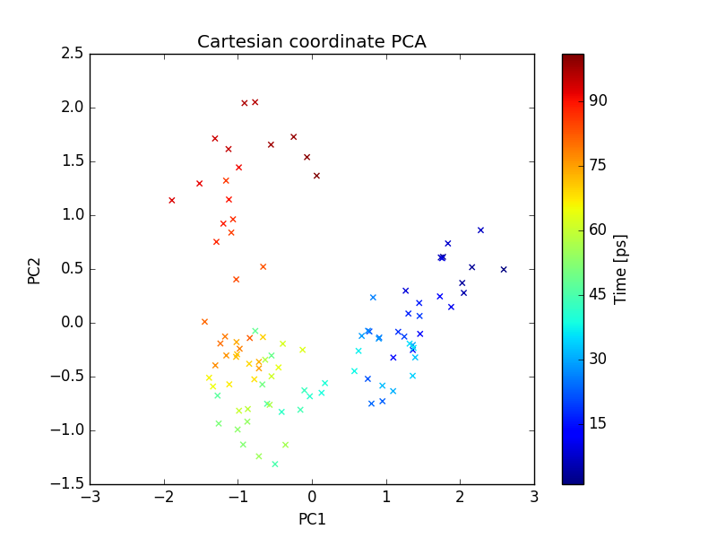
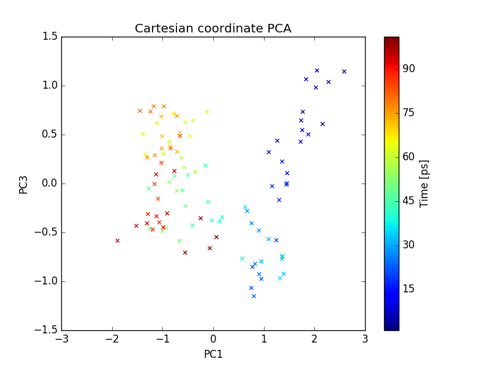
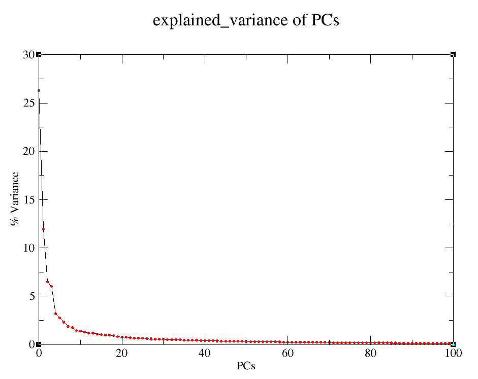
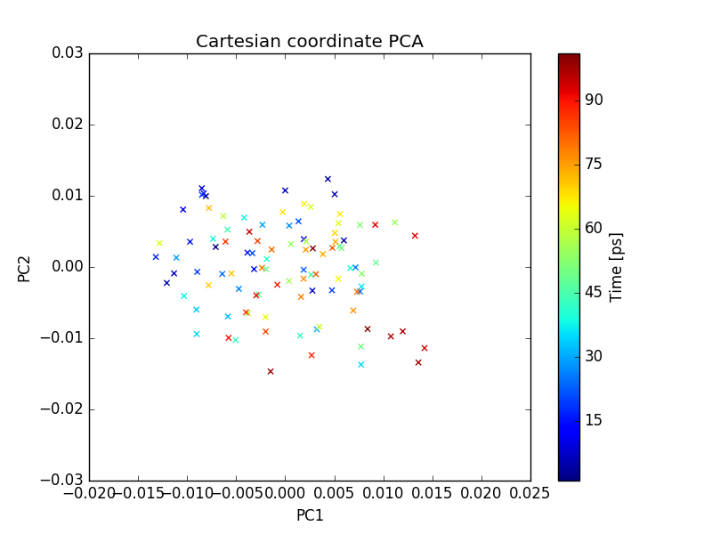
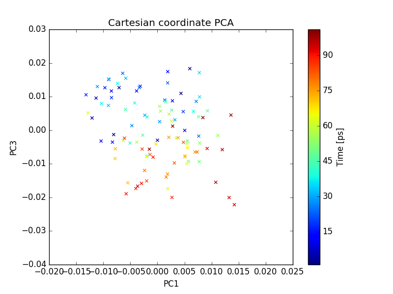
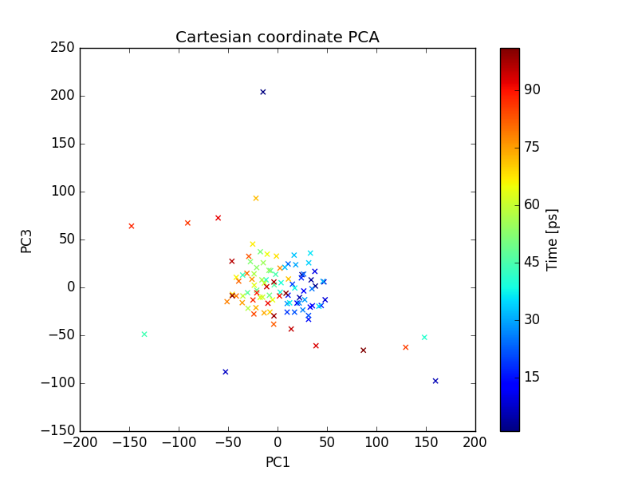

PCA Tutorial
====================================

PCA of a MD trajectory
-------------------------------

In this tutorial, we will be performing PCA on a MD trajectory of protein. Before doing the PCA we need to prepare the trajectory which includes removing periodicity and removing water molecules. Most of the MD packages have options to do this. We will be using GROMACS in this tutorial. We will be using .xtc format for trajectory and .pdb for topology file. Any other common trajectory format should also work with MODE-TASK. 

**1. Preparation of trajectory**

**1.1. Remove periodicity**

 ::

	gmx_mpi trjconv -s md_01.tpr -f md_01.xtc -o md_01_noPBC.xtc -pbc mol -ur compact

select system to apply it. 

**1.2. Remove water**

 ::
	
	gmx_mpi trjconv -s md_01.tpr -f md_01_noPBC.xtc -o md_01_noWAT.xtc -n index

and select protein

**2. Create a working directory**

First create a directory for all the MODE-TASK scripts using the Linux command:

 ::

	mkdir ModeTask

Copy the entire contents of the MODE-TASK scripts into the MODE-TASK directory.

Within this directory create a folder called Tutorial:

 ::

	cd ModeTask
	mkdir Tutorial

We will run all scripts from the MODE-TASK directory. Move the trajectory (md_01_noWAT.xtc) and topology file (complex.pdb) into the Tutorial directory.   

**3. Running PCA**

MODE-TASK includes tools to perform PCA on Cartesian coordinates as well as internal coordinates. It also allows users to run different variants of PCA on a single MD trajectory. 

**3.1. PCA on Cartesian coordinates**

Run the following command to perform the singular value decomposition (SVD) PCA on CA atoms.

 ::

	pca.py -t Tutorial/md_01_noWAT.xtc -p Tutorial/complex.pdb -ag CA -pt svd

**Output:**

**(a)-** Various output files are written to the out_md_01_noWAT.xtc directory. 
2D Plot of first 3 PCs, Scree plot, RMSD plot, and RMSD Modes plot. 
For details about these output files please refer to the MODE-TASK documentation. 

**(b)-** Command line output: Following output is redirected to command line. 

 ::

	Results will be written in out_md_01_noWAT.xtc
	Reading trajectory Tutorial/md_01_noWAT.xtc ...
	No reference structure given, RMSD will be computed to the first frame in the trajectory
	Trajectory info:
	Total 101 frames read from Tutorial/md_01_noWAT.xtc
	MD time is from 199000.0 to 200000.0 ps
	13244 atoms and 861 residues in the trajectory
	Atom group selected for PCA: CA
	Total 860 CA atoms selected for analysis
	KMO for input trajectory is 5.25051335835e-06
	RMSD written to rmsd.agr
	Performing SVD (Single Value Decomposition) PCA with 'auto' svd_solver
	Trace of the covariance matrix is:  4.9427056479
	cosine content of first PC= 0.777934456531
	cosine content of second PC= 0.643848137376
	cosine content of 3rd PC= 0.70061477062
	cosine content of 4th PC= 0.530112237076

**3.2. Visualizing the results**

2D Plot of the first 3 PCs in grace and png format are written. In order to open the .agr file with xmgrace run the following command.

 ::

	xmgrace out_pca_test_trj.xtc/pca_projection1_2.agr

You can also visualize the .png format figure plot by opening it with your favorite picture visualizer.  In the same way, open the rmsd.agr and pca_variance.agr. 

   Fig: plot of PC1 and PC2 

   Fig: plot of PC1 and PC3

   Fig: Explained variance of PCs 

**3.2. PCA on internal coordinates**

One can also do PCA on internal coordinates of a MD trajectory. Options are available for different types of internal coordinates such as, pairwise distance between atoms, 1-3 angle between backbone atoms, psi angle, and phi angle. Run the following command to do PCA on pairwise distance between CA atoms. 

 ::

	internal_pca.py -t Tutorial/md_01_noWAT.xtc -p Tutorial/complex.pdb -ag CA -ct distance

Run the following command to do PCA on backbone psi angles.
 
 ::

	internal_pca.py -t Tutorial/md_01_noWAT.xtc -p Tutorial/complex.pdb -ag CA -ct psi

Output files include 2D plot of first 3 PCs and scree plot, which can be visualized using xmgrace as described earlier. 

MDS (Multi-dimensional scaling) on a MD trajectory
----------------------------------------------------

To perform the MDS on pairwise RMSD between C-alpha atoms, run the following command.

 ::

	mds.py -t Tutorial/md_01_noWAT.xtc -p Tutorial/complex.pdb -ag CA -dt rmsd

Output files include 2D plot of first 3 PCs. Which can be visualize using xmgrace as described earlier.

   Fig: plot of PC1 and PC2  

   Fig: plot of PC1 and PC3  

t-SNE on a MD trajectory
-------------------------------

Run the following command to perform t-SNE using pairwise RMSD of CA atoms as the index of dissimilarity.

 ::

	tsne.py -t Tutorial/md_01_noWAT.xtc -p Tutorial/complex.pdb -ag CA -dt rmsd

Output files include 2D plot of the first 3 PCs, which can be visualize using xmgrace as described earlier. 

 .. figure:: ../img/tsne1.png
   :align: center

   Fig: plot of PC1 and PC2  

   Fig: plot of PC1 and PC3  

